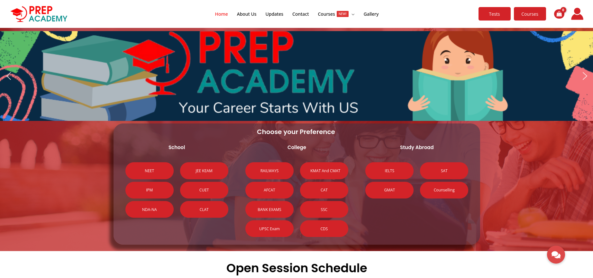

<div align="center">


</div>

<!-- PROJECT LOGO -->
<br />
<div align="center">
  <a href="https://prepacademy.in">
    
  </a>
  <h3 align="center">Prepacademy</h3>
  <div align="center">
    Learning Management System
    <br />
    <a href="https://github.com/tornotron/prepacademy/docs/README.md"><strong>Explore the docs »</strong></a>
    <br />
    <br />
    <a href="https://prepacademy.in">View Demo</a>
    ·
    <a href="https://github.com/tornotron/prepacademy/issues">Report Bug</a>
    ·
    <a href="https://github.com/tornotron/prepacademy/issues">Request Feature</a>
  </div>
</div>

<!-- TABLE OF CONTENTS -->
<details open>
  <summary>Table of Contents</summary>
  <ol>
    <li>
      <a href="#about-the-project">About The Project</a>
      <ul>
        <li><a href="#built-with">Built With</a></li>
      </ul>
    </li>
    <li>
      <a href="#getting-started">Getting Started</a>
      <ul>
        <li><a href="#prerequisites">Prerequisites</a></li>
        <li><a href="#installation">Installation</a></li>
      </ul>
    </li>
    <li><a href="#usage">Usage</a></li>
    <li><a href="#contributing">Contributing</a></li>
    <li><a href="#license">License</a></li>
    <li><a href="#contact">Contact</a></li>
    <li><a href="#acknowledgments">Acknowledgments</a></li>
  </ol>
</details>

<!-- ABOUT THE PROJECT -->
## About The Project

<div align="center">
  
 
  <!-- Add vertical space -->
  <br>  
  <br>  
  <br>  

</div>

* This is a WordPress based Learning Management system built with custom theme and plugins

## Major Features Include:

- **Student Onboarding**: Students can sign up and enroll for courses
- **E-Commerce**: Students can purchase courses and study materials
- **ERP Features**: The app has minimal ERP features to manage a coaching institute
<p align="right">(<a href="#readme-top">back to top</a>)</p>

### Built With

<p align="center">
  <a href="https://skillicons.dev">
    
  </a>
</p>

<p align="right">(<a href="#readme-top">back to top</a>)</p>

<!-- Using Shields.io and Simple Icons -->
<!--    -->


<!-- GETTING STARTED -->
## Getting Started

The app has to be deployed with a new WordPress installation.

### Prerequisites

This is an example of how to list things you need to use the software and how to install them.

* Ensure you have setup wp-local or XAMPP local server

### Installation

1.Run the tornotron automation scripts to setup local dev environment
2. Clone this repository using the command: `https://github.com/tornotron/prepacademy`
    ```sh
    git clone git@github.com:tornotron/prepacademy.git
    ```
3. Ensure to clone the repo to the correct directory of a new local installation

<p align="right">(<a href="#readme-top">back to top</a>)</p>


<!-- USAGE EXAMPLES -->
## Usage

### This repo is only for development!

<p align="right">(<a href="#readme-top">back to top</a>)</p>


<!-- CONTRIBUTING -->
## Contributing

Contributions are what make the open source community such an amazing place to learn, inspire, and create. Any contributions you make are **greatly appreciated**.

If you have a suggestion that would make this better, please fork the repo and create a pull request. You can also simply open an issue with the tag "enhancement".
Don't forget to give the project a star! Thanks again!

1. Fork the Project
2. Create your Feature Branch (`git checkout -b feature/AmazingFeature`)
3. Commit your Changes (`git commit -m 'Add some AmazingFeature'`)
4. Push to the Branch (`git push origin feature/AmazingFeature`)
5. Open a Pull Request

<p align="right">(<a href="#readme-top">back to top</a>)</p>


<!-- LICENSE -->
## License

Distributed under the GNU License. See `LICENSE.txt` for more information.

<p align="right">(<a href="#readme-top">back to top</a>)</p>


<!-- CONTACT -->
## Contact

Tornotron - [@tornotron](https://twitter.com/tornotron) - info@tornotron.com 

Project Link: [https://github.com/tornotron/prepacademy](https://github.com/tornotron/prepacademy)

<p align="right">(<a href="#readme-top">back to top</a>)</p>

## Branch Ownership

 | Status | Branch | Owner
 | --- | --- | ---
 |  | `development` | [Abhijith Anandakrishnan](abhijithananthan@gmail.com)


<!-- ACKNOWLEDGMENTS -->
## Acknowledgments

* Tornotron E Commerce Private Ltd. - [https://tornotron.com](https://tornotron.com)

<p align="right">(<a href="#readme-top">back to top</a>)</p>


